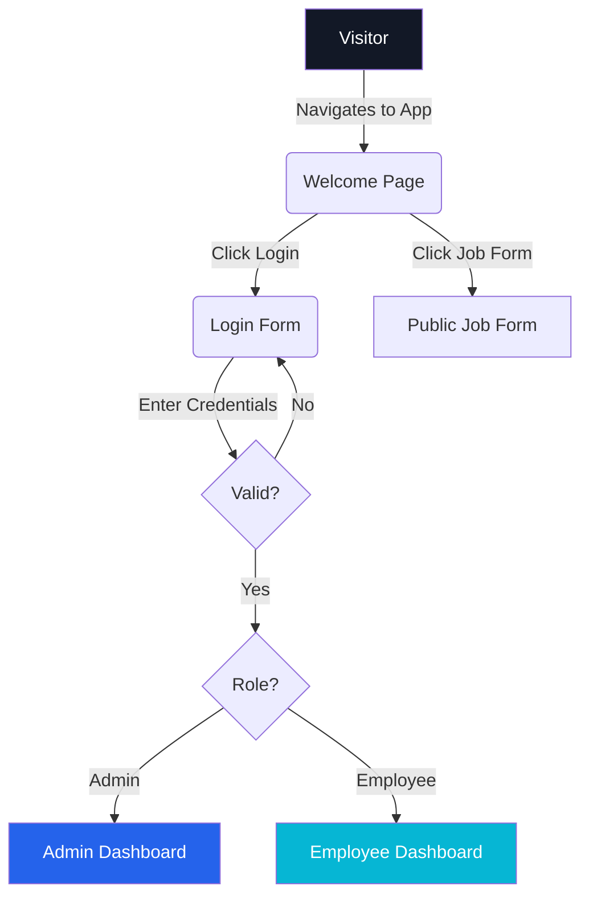
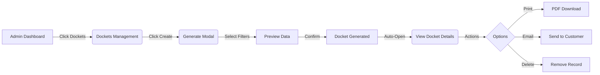
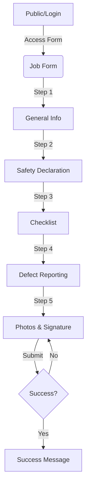
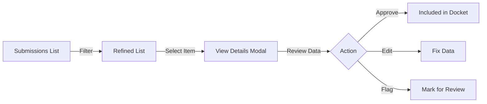

# User Experience (UX) Flow Diagram

## Core User Journeys
The following flows outline the primary interactions for different user roles within the Flowrite application.

### 1. Authentication Flow

### 2. Admin: Docket Management Flow

### 3. Field Worker: Job Submission Flow

### 4. Admin: Review Flow

